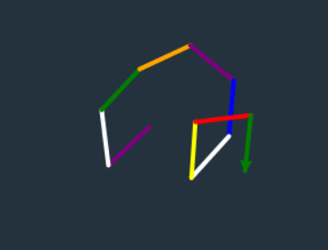

# udacity-python-28-days
learn Python on Udacity

[toc]

> 在线运行python 推荐网站 https://trinket.io/

> typora  以```开头 + 语言名(即 : python)，开启代码块，按换行键换行 

##	第一部分  turtle

**程序**是面向计算机的一组指令。程序由代码行组成。每行告诉计算机关于这些指令的一个特定细节信息。


###	变量  variable

a connection between a name in the code and some date in computer`s memory


### 赋值 assignment

> ~~~ python
> gorge = turtle.Turtle()
> ~~~

En : connect a name with some data in memory

中：将名称与内存中的数据相关联

等号叫做赋值运算符（assignment operator）

整个语句叫做赋值语句（assignment statement）

PS. 赋值语句右侧的代码始终先发生。（先创建再赋值分配）


### 字符串

单词 `"yellow"` 和 `"green"` 称为**字符串**。*字符串* 或 串 (String) 是由数字、字母、下划线组成的一串字符。它是编程语言中表示文本的数据类型。我们称`"yellow"` 这样一串代码为字符*串*


### 整数

此代码中出现的数字（例如 `1`、`90` 和 `100`）都属于*整数*。**整数**是一个没有分数或小数部分的整数。整数可以是正数、零或负数（例如 `-5`）。


### 列表

`[1, 2, 3, 4, 5]` 和 `[7, 2, 1, 0, 9]` 属于**列表**。在 Python 中，列表放入方括号里，并且用逗号分隔各项。


### 模块 module

a file that has a collection of useful code that we can be used in other Python programs.

> 注意，Python 区分大小写


### 方法 method

a block of code that`s hidden away somewhere else,that  this code has a name and now we can run it but using lines like amy.forword(100)

对叫做*amy*的Turtle对象调用*forword*方法，并为其输入100


### 注释

在代码中，**注释**是针对人类读者的消息。计算机在读取代码时，会忽略注释。在 Python 中，注释行以 `#` 开头

- with() 宽度，笔迹的粗细

- speed()速度，越大越快，0最快

- penup() 起笔，不会有笔迹

- pendown()落笔，重新有笔迹

  
  #### 注释快捷键
  在大多数代码编辑器中，你都可以使用很方便的键盘快捷键注释掉/取消注释一行代码。在 Mac 系统上，快捷键是 ⌘/。在 Windows 系统上，快捷键是 Ctrl + /。如果你将光标放在一行代码上，并按下此快捷键，编辑器将在代码行开头插入 #。


### 变量 variable

~~~ python
pretty_color = 'lightblue'
~~~


import turtle
mary_color = "purple"
step = 100
degree =72
sides =[1, 2, 3, 4, 5]
mary = turtle.Turtle()
mary.color(mary_color)
for side in sides:
    mary.forward(step)
    mary.right(degree)


### 循环 loop

> for ... in ...

side = [1,2,3,4,5] 列表里可以换成字符串，或者其他数字，甚至不同类型可以混合。只要个数不变，不影响画图。

> ```python
> for side in [1, 2, 3, 4, 5]:
>     amy.forward(100)
>     amy.right(72)
> ```

缩进和顺序很重要，没有缩进，就不执行缩进。

缩进空格数量不对，会提示

> **SyntaxError**
>
> **Line:**6
>
> **Error:**bad input


### 列表和循环

> ~~~python
> lengths =[10,20,30,40,50,60,70]
> for length in lengths:
> 	dizzy.forward(length)
> 	dizzy.right(90)
> ~~~

syntax注意冒号（colon）和缩进（indentation）

#### 夹角

> ~~~python
> import turtle
> 
> builder = turtle.Turtle()
> builder.color("red")
> builder.width(5)
> 
> # Copy the angles variable here!
> angles = [-90, 0, 0, -90,
>           135, 0, 0, 0, 
>           90, 0, 0, 0,
>           135, -90, 0, 0,
>           90, 0, 0, 0]
> for angle in angles:
>     # Turn right, then go forward 25.
>     # (How far to turn?
>     #  Use the angle variable!)
>     builder.right(angle)
>     builder.forward(25)
> ~~~


### 嵌套循环 Nested Loop

~~~python
import turtle
anna = turtle.Turtle()
for path in [1, 2, 3, 4]:
    for step in [1, 2, 3]:
        anna.forward(10)
~~~


### Turtle总结

- 移动

  lola.forward(n) 	前进，可以负数

  lola.back(n)

  lola.speed(s) 	速度，0时最快

- 转向

  lola.right(a) 	右转a度数，可以为负数

  lola.left(a)

- 绘制

  lola.penup() 	抬笔

  lola.pedown()	落笔

- 显示和隐藏

  lola.hideturtle()	隐藏箭头

  lola.showturtle()	取消隐藏


### 三种错误

编程中会出现三大类型的错误：**语法错误**、**用法错误**和**逻辑错误**

#### 语法错误

也就是拼写错误，少了后括号，或者for少了很容易落掉的冒号

#### 用法错误

就是不可以这样使用

~~~python
alison.forward("orange")
~~~

包含Python 的 `NameError` 和 `TypeError` 消息通常都是这种类型的错误。你之前见到的 `ZeroDivisionError` 也算是这种错误。

`NameError` 是一种常见的 Python 错误消息，表示代码在定义变量前尝试使用该变量。例如，如果尚没有叫做 `matthew` 的 turtle，`matthew.right(45)` 将抛出 `NameError`。

#### 逻辑错误

~~~python
import turtle
michael = turtle.Turtle()
for side in [1, 2, 3, 4, 5, 7, 8]:
    michael.forward(100)
    michael.right(45)
~~~

上面for中少了元素6，所以不是八边形

#### 缩进计算

~~~python
willow = turtle.Turtle()
for x in [1, 2, 3]:
    willow.forward(1)
    for y in [4, 5, 6, 7]:
        willow.forward(1)
    willow.forward(1)
~~~

一共前进了多少？

外循环每次进2格，共3次外循环，小计6

内循环每次进1，4次内*3此外，小计12

合计18

答案：由于一个循环在另一个循环里缩进了，因此不同的 `forward` 命令运行了不同的次数。第一个 `forward` 命令运行三次；第二个运行十二次，第三个运行三次。

#### 六边形

> 多边形移动角度，是360除以形状的边数。

***

## 第四课

### statements 语句

##### 简单语句 Simple Satements

* 赋值语句 Assignment Statements

~~~python
pretty_color = "Red"
amy = turtle.Turtle()
~~~

* 导入语句 Import Statements

~~~python
import xxx
~~~

* 调用语句 Call Satements

~~~python
amy.forward(100)
amy.color("Blue")
~~~

##### 复合语句 Compund statements

* for循环

复合语句用来控制Whether / When / How many times to run codes

复合语句包含冒号和缩进

##### 控制流  Control Flow

代码的运行顺序，叫做程序的控制流。复合语句会改变从上到下的控制流。

for循环改变了How Many Times 的控制流


#### range函数

[1,2,3,4] 相当于 range(4)

~~~python
sides = [0, 1, 2, 3, 4, 5, 6, 7, 8, 9, 10, 11, 12, 13, 14, 15, 16, 17, 18, 19, 20, 21, 22, 23, 24, 25, 26, 27, 28, 29, 30, 31, 32, 33, 34, 35, 36, 37, 38, 39, 40, 41, 42, 43, 44, 45, 46, 47, 48, 49, 50, 51, 52, 53, 54, 55, 56, 57, 58, 59, 60, 61, 62, 63, 64, 65, 66, 67, 68, 69, 70, 71, 72, 73, 74, 75, 76, 77, 78, 79, 80, 81, 82, 83, 84, 85, 86, 87, 88, 89, 90, 91, 92, 93, 94, 95, 96, 97, 98, 99]
range(100)
~~~


#### 数字运算

3 X 4 写成 3 * 4 （asterisk 型号），9 ÷ 3 写成 9 / 3 （slash 斜杠）

##### 表达式 Expression

a piece of code that resolves to some value，解析某个值的一段代码

~~~python
2 + 2
~~~

表达式有两部分，数字和符号（symbols）

operators 运算符和operands运算对象/运算数


~~(图片真实存在。如果看不到图片，因为总所周知的原因，你可能要想点办法)~~

图片看不到，更新host试下，[办法连接](https://blog.csdn.net/qq_38232598/article/details/91346392)

###### 变量也可以参与到算数运算符

~~~python
for side in [1, 2, 3, 4]:
    amy.forward(10 * side)
    amy.right(90)
~~~


#### 函数 Function

 range() 是 Python 的一个内置函数 

~~~python
print(range(5))
[0,1,2,3,4]
~~~

##### 调用语句或者调用 call statement or call

~~~python
range(100)	#调用range
~~~

##### argument 参数

~~~python
range(100)	#100即为传递的参数
~~~

调用函数-->传递参数-->返回结果

##### method call 和 function call

```python
amy.forward(100)	#method call
range(100)			#function call
```

方法是是一种特殊的函数，所有方法都是函数。但并非所有的函数都是方法

函数部分知识小结

1. 函数：一块有名字的代码，他在我们调用他之前，不会自主运行 
2. 函数调用 ： 让函数运行的语句
3. 参数 ： 再调用函数时，传递的数值
4. 方法 ： 与对象有关的函数

#### 定义函数

> 定义函数再封装重复使用相同部分的代码


> 必须在调用函数之前定义函数，否则会遇到如下所示的错误：
>
> **Error: name 'draw_square' is not defined**

 函数定义始终以 `def` 开头，然后是函数名称，括号 `()` 和冒号 `:` 

~~~python
def function_name():
    xxxxxxxxxxxxxxxxxxxx
    for _ in range(20):
        XXXXXXXXXXx
        
function_name()
~~~

#### 参数 argument

##### 形参 parameters

定义函数的参数，形式上的

 形参并不是什么高级概念，它就是变量。 

~~~~pytho
def spiral(sides, turn, color, width):
~~~~

##### 实参 argument

调用函数时传入的实际参数

 实参也不是什么高级概念，它只是我们传递给函数的输入 

~~~python
spiral(150, -30, "blue", 10)
~~~

 ##### 传递

当我们提到它“传递”此实参时，是指它将此数字赋值给相应的形参 

因此“向函数传递实参”其实就是向变量赋值的另一种方式 


~~~
#画个正方形
import turtle
jack = turtle.Turtle()
jack.color("yellow")

def draw_square():
    for side in range(4):
        jack.forward(100)
        jack.right(90)

draw_square()
~~~


#### 变量范围 variable scope

> 函数定义的变量只能在该函数内使用，局部（内部）变量，local scope

> 全局变量 global scope，在函数外定义

变量来自：

## 变量来自哪里？

很多变量是由赋值语句创建的，例如 `intensity = 10`。但是还可以通过其他方式创建变量。你在这门课程中已经见过很多种方式。

- 每个 `for` 循环都会创建一个变量，例如 `for step in dance:` 中的 `step` 变量。如果该循环在函数内，则该变量是局部变量。
- 每个 `import` 语句都会创建全局变量，然后使用该变量引用导入的模块。例如，语句 `import turtle` 在内存里创建了 *turtle* 模块的副本，并创建一个叫做 `turtle` 的变量，用来引用该数据。然后，当你需要引用该模块时，你可以在代码中使用 `turtle`。换句话说，`import turtle` 语句创建了一个变量，其名称是 `turtle`，值是 turtle 模块本身。
- 每个函数定义都会创建一个变量。函数名称（例如上方的 `bounce` 和 `boogie`）都是变量！创建了这些变量后，我们就可以在之后需要时引用该函数（例如调用函数时）。
- 当函数有形参时，例如上方代码里的 `something`，这些形参是该函数的局部变量。

### 变量的作用域

~~~ python
import turtle

def draw_square(who,length):
  for side in range(4):
    who.forward(length)
    who.right(90)
    
def draw_flower(size,petals):
  doodler = turtle.Turtle()
  doodler.color("orange")
  doodler.width(3)
  doodler.speed(0)
  for petal in range(petals):
    draw_square(doodler,size)
    doodler.right(360/petals)
    
draw_flower(100,99)
~~~

从上到下解读

1. 导入turtle 模块 module【全局】

2. 运行函数定义 draw_squre 【全局】，将函数主体所有代码放入内存，并与之关联、

3. 定义函数 draw_flower【全局】，(代码只是被保存，没有实际运行)

4. 调用函数 draw_flower，size = 100, petals = 99

5. 然后调用turtle 函数 创建Turtle对象，并保存到doodler 变量中

6. 改变doodler 颜色和宽度

7. 进入for循环，range出 0-6的7个数字

8. 调用draw_square全局变量，传入doodler和 100，赋值给形参length 100.

   draw_square 是看不到petals的，因为petals是draw_flower的局部变量


### 两个Turtle

~~~python
import turtle
romeo = turtle.Turtle()
juliet = turtle.Turtle()
~~~

创建两个不同的 turtle 对象（一个叫做romeo。一个叫juliet）

 那么在内存中有两个不同的底层对象。意味着我们可以单独对这两个对象设置颜色。 


### 同一个Turtle

~~~python
import turtle
romeo = turtle.Turtle()
montague = romeo

montague.color("red")
montague.width(5)

montague.forward(100)
montague.right(90)
montague.forward(100)
montague.right(90)
romeo.color("white")
montague.forward(100)
montague.right(90)
montague.forward(100)
montague.right(90)
~~~

在中间，更改了romeo的颜色，mantague后面的也会改变。

### 函数调用函数

~~~python
import turtle

romeo = turtle.Turtle()
romeo.color("violet")
romeo.speed(8)

def draw_square(some_turtle):
    for side in range(4):
        some_turtle.forward(100)
        some_turtle.right(90)

def draw_flower(some_turtle):
    for petal in range(6):
        draw_square(some_turtle)
        some_turtle.right(60)
    some_turtle.hideturtle()

draw_flower(romeo)
~~~

调用逻辑如下图


分开写有分开写的好处

 这种方法很常见，因为它有很大的优势。例如，我们可以在这个程序中添加其他的代码，用 `draw_square` 函数来做点别的事情（而不是画花）。通过将不同的任务分解到不同的函数中，可以让代码使用更方便，也更灵活。 

做练习时，我有写在一起的方法，更少的行数，失去了灵活性。

4-23-花瓣_函数调用函数.py

## 第五课 函数 第二部分

### if

~~~python
squids = 17
becky = turtle.Turtle()
becky.color("red")
if squids == 42:
    becky.color("blue")
becky.width(5)
~~~


最后颜色为 red 因为if条件没有满足


### 循环中加入条件判断

~~~python
import turtle
jack = turtle.Turtle()
jack.color("yellow")

for side in range(4):
    if side == 3:
        jack.color("blue")
    jack.forward(100)
    jack.right(90)
~~~

range(4) 会创建序列 0, 1, 2, 3，所以 side 将在循环的 第四次 时，取值为 3 。


下面这道题做错了

~~~python
import turtle
jack = turtle.Turtle()
jack.color("yellow")

for side in range(4):
    if side == 2:
        jack.color("blue")
    jack.forward(100)
    jack.right(90)
~~~

> 颜色更改为蓝色（第三条边）后，没有将其改回黄色的代码，因此在画第四条边时，依然是蓝色。 

### if else

~~~python
import turtle
jack = turtle.Turtle()
jack.width(5)


for side in range(4):
    if side == 1:
        jack.color("blue")
    else:
        jack.color("yellow")
    jack.forward(100)
    jack.right(90)
~~~


### 模运算 modulo

#### 取余数 %

7 % 2 = 1

7除以3 得2 余1

1%5 = 1

>  我们可以把 1 分成多少组 5 ？在我们把它分成 5 个一组之后还剩下多少？ 

 我们并不能把 1 分成 5 个一组。所以我们有 0 组，每组 5 个，剩下原来的1（余数是1） 

>  如果 `a % b` 中 `b` 更大，那么余数就是 `a` 

> 对于任何数字 y，x % y 的值始终小于 y 本身。

小乌龟画楼梯：

~~~python
import turtle

amy = turtle.Turtle()
amy.speed(0)
amy.width(4)
amy.color("orange")

for _ in range(10):
    amy.forward(20)
    if _ % 2 == 0:
        amy.left(90)
    else:
        amy.right(90)
~~~


 模运算经常与 `for` 和 `if`语句一起使用 

~~~python
for n in range(12):
   if n % 3 == 0:
      draw_triangle()
   else:
      draw_square()
~~~

### 返回值

~~~python
def simple_function():
    return 10

distance = simple_function()
~~~

return 关键字

~~~python
import turtle
t = turtle.Turtle()
t.color("white")
t.width(1)
t.speed(0)
t.hideturtle()

def square(number):
    return number**2

for n in range(540):
    angle = square(n)
    t.right(angle +.5)
    t.forward(5)
~~~

上面代码画出一个很有意思的封闭图形


函数可以返回多个返回语句。但是被调用时，运行到第一个返回语句后就会停止。除非放在判断语句，比如 if else 中

~~~python
import turtle

def super_reptile():
    amy =turtle.Turtle()
    amy.speed(0)
    return amy


clark = super_reptile()
clark.forward(100)
clark.left(45)
clark.forward(100)
# up, up, and away!
~~~


小练习

~~~python
def mystery():
    for word in ["love", "peace", "kittens"]:
        return word
    return "doom"
~~~

上面将返回的时love。 在第一次遍历循环时，`word` 的值是 `"love"`。函数从未遍历列表的剩余部分。`"doom"` 行是无用代码。 

如果改成下面这样

~~~python
def mystery():
    for word in ["love", "peace", "kittens"]:
        #return word
         name =word
    
    return name
print(mystery())
~~~

返回的才是最后一个kittens


### 循环和实参

turtle 上的 `forward` 方法仅接受一个实参：如果 `mark` 是 turtle，那么 `mark.forward(10, 20)` 将出错。

这意味着，如果你更改函数接受的实参数量，还需要更改调用该函数的每一处代码


### 复合语句

 目前为止见过的各种**复合语句**。有三种复合语句：**for** 循环、函数定义 **def** 和 **if** 语句。 

共同特点

-  第一行始终以该语句的关键字开头：`for`、`def` 或 `if` 
-  第一行始终以冒号 `:` 结尾 
-  剩余代码行属于代码块，都按照相同的空格数量缩进 

### random模块

#### 确定性 deterministic program

always products the same output for a give input.

#### **import random**，不导入，会报错

~~~
ameError
Line:12
Error: name 'random' is not defined
~~~


- random.randint 随机选择一个整数，接受两个参数，最小值和最大值.

  ~~~python
  # Roll a six-sided die.
  dieroll = random.randint(1, 6)
  ~~~

  

- random.choice,接受一个参数，必须为列表

~~~python
cards = ["ace", 2, 3, 4, 5, 6, 7, 8, 9, "jack", "queen", "king"]
# Pick a card at random.
mycard = random.choice(cards)
~~~

练习：

~~~python
import turtle
import random
colors = ["red", "orange", "yellow", "green", "blue", "purple","white"]

t = turtle.Turtle()
t.width(4)
t.speed(0)

for step in range(10):
    # Change this to use a random number.
    angle = random.randint(5,150)

    # Change this to use a random color.
    color = random.choice(colors)

    t.color(color)
    t.right(angle)
    t.forward(50)

~~~



### 不等式

#### 比较运算符

| **运算** |        **含义**         |
| :------: | :---------------------: |
| `a == b` |    `a` 等于 `b` 吗？    |
| `a < b`  |    `a` 小于 `b` 吗？    |
| `a > b`  |    `a` 大于 `b` 吗？    |
| `a <= b` | `a` 小于或等于 `b` 吗？ |
| `a >= b` | `a` 大于或等于 `b` 吗？ |
| `a != b` |   `a` 不等于 `b` 吗？   |

~~~python
def temperatureColor(temp):
    if temp < 30:
        color = "blue"
    else:
        if temp < 60:
            color = "purple"
        else:
            color = "red"
    return color
~~~


### elif

elif解决了必须if嵌套的代码复杂问题

比如之前写法如下：

~~~python
if mood == "happy":
	amy.color("red")
	else:
		if mood == "sad":
			amy.color("blue")
		else:
			amy.color("gray")
~~~

如果上面都只是写在外面，如下方写法，就会和预计出错

~~~python
if mood == "happy":
	amy.color("red")
if mood == "sad":
	amy.color("blue")
else:
	amy.color("gray")
~~~

因为最后一个else是和第二个if对应的。所以即便mood = "happy",颜色却是gray。

尤其是在多重判断时，会让嵌套变得冗长

使用elif来解决

~~~python
if mood == "happy":
	amy.color("yellow")
elif mood == "sad":
	amy.color("blue")
elif mood == "angry":
	amy.color("red")
else:
	amy.color("gray")
~~~

### 逻辑运算符

and / or运算符

~~~python
if x > 0 and x < 10:
    # Do something
~~~

支持以上写法，都满足条件才运行,而且支持多个联合起来用

~~~python
x > 0 and x < 10 and y > 0 and y < 10
~~~


### Turtle边界问题

xcor ，X coordinate : horizontal value

ycor , Y coordinate : vertical value

来检查tutle的当前位置

~~~python
 t.penup()
 t.home()
 t.pendown()
~~~

home()  将画笔返回到原点 

练习

~~~python
import turtle

t = turtle.Turtle()
t.color("lime")
t.width(3)
t.penup()
t.shape("turtle")

for step in range(2000):
    t.forward(1)
    # Add your code here
    if t.xcor() > 20 or t.xcor()< -20:
        t.right(90)
~~~

以上有趣的是

~~~python
 t.right(90)
 和
 t.right(180)
 效果基本一致
~~~


#### 复习

 函数调用 `random.randint(0, 359)` 将返回一个从 `0` 到 `359` 的随机数字，也就是随机整数夹角。不需要达到 `360`，因为转动 `360` 度和一开始的朝向一样，也就是转动 `0` 度。 

random.randint 必须有两个参数

random.randint(range(359))

### 第六 大练习 房贷计算器

遇到的问题点记录

1. 关于平方的计算方式是**。例如等额本息的公式

   ~~~
   monthly_payment = round((P*R*(1+R)**N)/((1+R)**N-1),2)
   ~~~

   

2. print中打印变量是使用%i,%.2f 来绑定

   ~~~python
   print("EPP等额本金:第  %i  月，需要还款 %.2f" %(n, monthly_payment) )
   ~~~


## 第七课  安装Python

>  每版 Python 的版本号都由三部分数字组成，例如 Python 2.7.9 或 Python 3.6.2。版本号的不同部分表示更改幅度有多大。第一个数字表示存在大型改动，第二个和第三个数字表示存在更小型的改动。 

 我们将使用 **Python 3.x**（意味着任何以 **3** 开始的版本都可以）。要获取所有最新功能，建议使用 **Python 3.6** 或更高版本。 

 https://www.python.org/downloads/ 

1. 选择自定义安装
2. 添加python 到环境变量

#### 终端里使用python

- input 函数

~~~python
input("What's your name?")
~~~

一般赋值到变量

~~~python
name = input("What's your name?")
~~~

input 也可以不传入参数

- print 函数

  如果是要直接输出所见，不进行运算，需要加上双引号

  **接受多个参数，以逗号分隔。结果是空格分隔显示**

#### 交互模式 interactive mode

三个大于号 起始

交互模式的代码不会保存

退出 win Ctrl+C / Mac Ctrl+D

##### 复合语句

在交互模式下书写复合语句，

~~~python
>>> for side in range(4):
...
~~~

会显示三个点，留意四个空格缩进。

 要退出循环并运行循环，直接再按一次 Enter 键。 

#### 复习函数

~~~pyth
def confuse():
    print ("bears")
    return 42

confuse()
print(confuse())
~~~

一个直接调用函数，只有打印 bears，如果打印调用的结果，就会有两个bears和42。因为，在交互界面，return不打印，不显示。

 Python 用 `None` 表示没有值 ，如果函数没有返回值，就返回None 不是什么都不返回。如下：

~~~python
def more_confused():
    2 + 2

print(more_confused())

~~~

如果有两个return，只会返回第一个

~~~python
def say_hello():
    return "Hello!"
    return "Goodbye!"

print(say_hello())
'''
只有"Hello!" 会显示
'''
~~~


#### 交互式里的函数

 交互模式下返回值时，该值会显示出来。但是文件里的return不会显示

 这是在交互模式下运行代码的一个好处。任何时候，只要输入语句或表达式，交互模式将显示返回值。这样使你能够更熟悉代码的内部情况。 

 因为交互模式会显示任何返回值（即使没有对这些值执行任何操作）。 

如果是没有return和print 就无任何返回

~~~python
>>> def nothing():
...     2+2
...

~~~

#### 错误类型

操作数和运算符 

~~~python
>>> 2 + "fish"

Traceback (most recent call last):
  File "<stdin>", line 1, in <module>
TypeError: unsupported operand type(s) for +: 'int' and 'str'
~~~


~~~python
>>> n = input("input a number:")
input a number:4
>>> n
'4'
>>> n+2
Traceback (most recent call last):
  File "<stdin>", line 1, in <module>
TypeError: can only concatenate str (not "int") to str
>>>
~~~

input 总是返回string，解决办法格式化

~~~python
n = int(input("Please enter a number:"))
~~~


#### 导入模块

 在导入时，不要在文件名后面添加文件扩展名 。

 注意，和调用 `turtle` 模块里的方法一样。我们需要输入 `turtle.right(90)` 和 `turtle.forward(100)`，而不是直接输入 `right(90)` 和 `forward(100)`。 


~~~python
import antigravity

打开浏览器，默认 https://xkcd.com/353/ 网络漫画
~~~


## 第九课 字符串和列表

#### 变量

变量名 variable name 也叫做标识符 identifier

~~~python
>>> "cake" = "yummy"
  File "<stdin>", line 1
SyntaxError: cannot assign to literal
~~~

Literals 字面量

数字和字符串 没有办法再次赋值，会报错SyntaxError : can`t assign to literal. 因为数字和字符串已经固定了绑定本身，是字面量。

#### 字符串

单引号和双引号，都可以使用，但是必须成对使用。

\n 换行，可以一起使用多个

- 单引号`'`与双引号`“`
- 换行符`\ n`
- 转义符`\`
- 三引号`"""`

单双引号，可以互换再外面，来显示需要显示内部存在的。

如果内容包含两种，

1. 使用反斜杠转义字符。
2. 三引号来包含


练习

~~~python
>>> def print_all(your_list):
...     for li in your_list:
...         print(li,'\n')
~~~

答案

~~~python
def print_all(strings):
    for string in strings:
        print(string)
~~~

 更复杂的字符串

~~~python
'''
"Is it very long?" Alice asked, for she had heard a good deal of poetry that day.

It's long," said the Knight, "but it's very, very beautiful."
'''

print("""\"Is it very long?" Alice asked, for she had heard a good deal of poetry that day.

It's long," said the Knight, "but it's very, very beautiful.\"""")

'''答案
print('"Is it very long?" Alice asked, for she had heard a good deal of poetry that day.\n\n"It\'s long," said the Knight, "but it\'s very, very beautiful."')

答案二
print("""
"Is it very long?" Alice asked, for she had heard a good deal of poetry that day.

"It's long," said the Knight, "but it's very, very beautiful."
""")
'''
~~~

三引号`"""`可以，四引号`""""`不可以！

SyntaxError: EOL while scanning string literal.

问题出在字符串末尾的四个引号`""""`上。Python将**其中的前三个**视为已到达字符串末尾的信号 — 因此，当它随后遇到第四引号时，它认为我们正在开始一个新的字符串。然后我们再也不会关闭该新字符串，这就是导致错误的原因。

#### 复习函数和类型

 `input` 函数始终返回字符串 

~~~python
number = input("Enter a number!")
~~~


 如果你要求 Python 输出无法转换为字符串的对象（例如模块、函数或 turtle），系统就会显示这种带 `<尖括号>` 的消息。但这不是错误消息。 

~~~python
import turtle
print(turtle)

~~~

会返回

~~~python
<module 'turtle' from 'C:\\Users\\Admin\\AppData\\Local\\Programs\\Python\\Python38\\lib\\turtle.py'>
~~~

#### 长度 len()

起止冒号不计算在内， 字符串中的**所有字符都算在内，包括空格** 

也适用于list [],项目中的数量

~~~python
TypeError: object of type 'int' has no len()
TypeError: object of type 'function' has no len()
~~~

表情符号

~~~python
import unicodedata
>>> unicodedata.lookup("airplane")
~~~

~~~python
>>> len("🐍")
1
>>> len("蛇 = 🐍")
5
~~~

 表情符号在屏幕上的占据空间通常比字母或数字更宽；在等宽字体中，它们通常占据两个字符。并且占据更多计算机内存。但是 Python 字符串的长度仅取决于其中的字符数量，而不是什么类型的字符

#### 遍历字符串

for 可以遍历列表和字符串

~~~python
message = input("What do you have to say, hm?\n")

for ch in message:
    if ch == "?":
        print("Sense much curiosity in you, I do.")
    if ch == "!":
        print("Enthusiastic, you are.")
~~~

#### 字符串计数

在开始计数之前，我们必须分配`count`变量的初始值

~~~python
count = 0
for ch in "bonobos":
    if ch == "o":
        count +=1
print(count)
~~~

~~~python
def count_character(full_srt,search_str):
    count = 0
    for ch in full_srt:
        if ch == search_str:
            count = count + 1
    return(count)


print("Should print a count of 3:")
print(count_character("oxen and foxen all live in boxen", "x"))

print("Should print a count of 0:")
print(count_character("that letter isn't here", "x"))

print("Should print a count of 9:")
print(count_character("the goofy doom of the balloon goons", "o"))

print("Should print a count of 6:")
print(count_character("papa pony and the parcel post problem", "p"))

print("Should print a count of 0:")
~~~


#### 索引 index

字符串和列表都有len()

字符串和列表都是0开始索引

索引运算符 subscript operator /index operator [1]

练习

~~~ python
def start_k(s):
    return s[0] == 'k' or s[0] == 'K'
~~~

留意，以上代码区分大小写

##### 负索引

 如果 `word` 是一个字符串，那么 `word[-1]` 是该字符串的最后一个字符，`word[-2]` 是倒数第二个，等等 

##### 零索引

~~~python
no_words = ""
print(no_words[0])
~~~

上面会返回

> IndexError: string index out of range

~~~python
"apple"[-6]
~~~

也是超出index的范围报错。

练习题

~~~
"Art3mis"[3][0][0] 的值是多少？
~~~

> `"Art3mis"[3]` 的值是字符串 `'3'`。`'3'[0]` 的值也是 `'3'`。
>
> 对于任何非空字符串 `x`，`x[0]` 的值和 `x[0][0]` ... 甚至 `x[0][0][0][0][0]` 一样。

### range 函数

~~~python
>>> for n in range(4):
...     print(n)
0 1 2 3
~~~

当你传递一个数字时，range会给您返回一个序列，该序列**不包括最大的那个数字**。有时你会听到这被描述为**“exclusive”**范围，因为你给出的数字被*“excluded（排除）”*了。

~~~python
 for n in range(1,4):
...     print(n)
...
1
2
3
>>> for n in range(97,101):
...     print(n)
...
97
98
99
100
>>> for n in range(0,10,2):
...     print(n)
...
0
2
4
6
8
~~~

range(起始，终结【不包含】,步长【step】)

~~~python
>>> for n in range(0,10,1.5):
...     print(n)
...
Traceback (most recent call last):
  File "<stdin>", line 1, in <module>
TypeError: 'float' object cannot be interpreted as an integer
~~~


### 超出范围

交互模式错误中会有一个文件名<stdin>的提示

STDIN 代表 standard input 标准输入的简称，也就是是键盘输入产生的

~~~python
no_words = ""
print(no_words[0])

IndexError: string index out of range
~~~


#### Tracebacks（最近的调用在最后）

 当函数调用出现（非语法）错误时，Python 将尝试告诉你导致该错误的整个函数调用流程。 

#### indexError

如何避免索引错误：

1. 不使用索引，直接for chr in word
2. 使用字符串/列表的长度，for n in range(len(word))

### 切片 Slice

截取部分 

~~~python
'apple'[0:3]
#app
~~~

将包含第一个位置开始，一直持续到第二个值（但不包含），从0开始的话，可以省略0

~~~python
'apple'[:3]
~~~


如果第二个值超出剩余长度，则取出剩下全部，并不会报错

~~~python
'balloon'[3:8]
~~~

等同于

~~~python
'ballon'[3:]
~~~

结果都是 loon

~~~python
>>> "presto"[1024:4096]
''
~~~

此表达式将仅包含六个字符的字符串中取出位置从 1024 到 4096 的字符。这看起来像是一定会产生索引错误的代码，但是 Python 只会返回它能取到的一切。它在这些位置上无法获得任何内容，因此仅返回一个空字符串。

#### 特殊情况

 如果 `word` 是一个字符串，`word[:]` 将是 `word` 的副本。 

 如果切片尝试提取字符串末尾之外的字符，将返回至多能获取的字符，即使什么也没有

~~~python
def word_triangle(word):
    # Add your code here
    for n in range(len(word)):
        print(word[:-n])
        
word = input("type a long word : ")
word_triangle(word)
~~~


### 字符串操作

#### 连接

**+号**，可以拼接字符串和空格

不可以拼接字符串和int

前后顺序不同，结果不同

#### f-字符串

寻找花括号的变量名并替换，f 是formatting的简写

3.6 之后才有，f去寻找花括号的变量的值，可以解决数字不能与字符串相连的

~~~py
name = 'Burt'
f"What your {name}?"
~~~

不需要拼接用的加号和引号

以下交互模式

~~~python
>>> import math
>>> f"PI is about{math.pi:0.6}"
'PI is about3.14159'
>>> 6代表总共六位数的精度
~~~

#### 字符串和数字转换

int() 和float()

~~~python
 n = int(input("Please enter a number: "))
~~~

字符串不能进行加法运算 TypeError 错误

~~~python
>>> n =7
>>> print('hello'+n)
Traceback (most recent call last):
  File "<stdin>", line 1, in <module>
TypeError: can only concatenate str (not "int") to str

~~~

3个数求和

~~~python
def inputnumbers():
    arry={}
    total = 0
    for n in range(3):
       #arry[n] = int(input(f"input the No.{n} number: \n"))
       total += int(input(f"input the No.{n+1} number: \n"))
    
    print(total)
inputnumbers()
'''
n1 = input("Enter a number: ")
n2 = input("Enter another number: ")
n3 = input("Enter a third number: ")
sum = int(n1) + int(n2) + int(n3)
print(f"{n1} + {n2} + {n3} = {sum}")
'''
~~~


### 比较和排序

 `==`、`<` 和 `>` 等比较运算符在字符串上的效果和数字一样 

 字符串可以根据它们所含的字符排序。顺序和字母表顺序相似，但是并不完全一样： 

 你可以使用 `ord` 函数查询每个字符的数字值 

~~~python
print( ord('N')) #78
print( ord('A')) #65
print( ord('a')) #97
~~~

 `'A'` 开头的字符串将 `<` 任何以小写的 `'a'` 开头的字符串 


### starts_with

~~~python
# Add your function definition here
def starts_with(s1, s2):
    return (s1[0] == s2[0])
# A call like this should return True:
print(starts_with("banana", "bread"))

# And one like this should return False:
print(starts_with("zebonkey", "kiwi"))

'''
def starts_with(s1, s2):
    if s1[0] == s2[0]:
        return True
    else:
        return False
'''
~~~

第二版

~~~python
# Write your function definition here.
def starts_with(long,short):
    for n in range(len(short)):
        return(long[n] == short[n])
# A call like this should return True:
print(starts_with("apple", "app"))

# And one like this should return False:
print(starts_with("manatee", "mango"))
'''
def starts_with(long, short):
    for position in range(len(short)):
        if long[position] != short[position]:
            return False
    return True
'''
~~~

第三版

~~~python
# Write your function definition here.
def starts_with(long,short):
    return(long[:len(short)]==short)
# A call like this should return True:
print(starts_with("apple", "app"))

# And one like this should return False:
print(starts_with("manatee", "mango"))
~~~

第一个使用字符串索引操作，因此，当`position`变得大于`short`的长度时，会产生`IndexError`。另外两个使用切片，不产生`IndexError`。


### 字符串和数字互换

字符串和数字无法用+号直接拼接

int() 转化成整数，正数/负数/0

float() 转化成浮点数 float('56.234')

如果转化非数字字符串，回返回错误 ValueError


数字转字符串使用 str()

交互模式，拼接时间

~~~python
>>> hours = 21
>>> minutes = 16
>>> str(hours)+':'+str(minutes)
'21:16'
>>> f'Now is {hours} : {minutes}'
'Now is 21 : 16'
>>>
~~~


循环种累加

~~~python
for i in [1,2,3]:
		x = input('type the No.'+str(i)+' number(int/float) : ')
		t += float(x)
~~~

#### 字符串方法

判断语句，一般可以简写成

~~~python
return long[:len(short)] == short
~~~

不需要复杂的 return True /return False

**自带的有比较的函数 endswith / startswith** 

~~~python
>>> "banana".startswith("ban")
True
>>> "bonobo".startswith("ban")
False
~~~

HTML 标签判断

~~~python
def possible_tag(word):
    if word.startswith("<") and word.endswith("/>"):
        print(word,"could maybe be an HTML tag.")
    else:
        print(word,"is definitely not an HTML tag(but might contain one)")
        
possible_tag("<a apple />")
~~~

[官方String Methods档案]( https://docs.python.org/3/library/stdtypes.html#string-methods )

摘录

 `find`(*sub*[, *start*[, *end*]]) 

~~~python
>>> 'Py' in 'Python'
True
~~~

 `format`(**args*, ***kwargs*)  和f一样

~~~python
>>> "The sum of 1 + 2 is {0}".format(1+2)
'The sum of 1 + 2 is 3'
~~~

### 布尔值

True False

布尔运算有: and  or  not


 将其他值当做布尔值 

- 对于数字，零值被视为 false，所有非零值都被视为 true。
- 对于字符串，空字符串被视为 false，所有非空字符串都被视为 true。
- 对于列表，空列表被视为 false，所有非空列表都被视为 true。

### 课程10.列表 [ ]和字符串

 在 Python 中，列表和字符串具有一些共同点。它们都是**序列类型** — 它们表示一系列值，而不是单个值 

 **索引**操作、**切片**操作和 **`len` 函数**。因为它们都适用于序列，因此也适用于列表： 

len函数

~~~python
# Add your code here.
def total_length(list):
    total =0
    for n in list:
        total += len(n)
    return(total)
        
# Should return 6:
print(total_length(['foo', 'bar']))

# Should return 0 (it's an empty list):
print(total_length([]))

# Should return 8:
print(total_length(['balloons']))

# Should return 0 (it has four empty strings):
print(total_length(["", '', "", '']))

'''
def total_length(list_of_strings):
    total = 0
    for string in list_of_strings:
        total = total + len(string)
    return total
'''
~~~


#### 列表方法

~~~python
words = ["echidna", "dingo", "crocodile", "bunyip"]
~~~

1. append 

    `append` 方法会将项目添加到列表的末尾 

   ~~~python
   words.append("platypus")
   ~~~

   改变但是，不会有返回值

2. extend 

   会把字符串当成是 由单个字符组成的列表

   ~~~python
   words.extend("abc")
   ~~~

   传递的是字符串时，在words的结尾添加上，, 'a', 'b', 'c'

   ~~~python
   words.extend(["kangaroo", "wallaby"])
   ~~~

   则会在末尾添加 "kangaroo", "wallaby"。 当你将列表传递给 `words.extend` 时，它将该列表中的项目添加到 `words` 中。 

   append 是看做一个整体添加，哪怕是一个list，整体最为一个新的元素，添加到被添加的list

   ​	将其参数作为**单个项目**添加到列表的末尾。它只会在列表中添加**一个项**。

   extend会先拆开，字符串或者是list，然后一个一个的添加到末尾

   ​	将其参数视为一个序列，并**将序列中的每个项目添加到列表的末尾**。换句话说，它将项目的**序列**添加到列表中。

3. reverse

   ~~~python
   words.reverse()
   ~~~

   

   `reverse` 方法颠倒了列表的顺序。 

4. sort

   排序

    `sort` 方法会修改列表，使其按顺序排列 

以上4种方法都适用并修改列表，但是不返回任何值。

#### 可变性和共享结构

字符串和列表有很多相似的操作，但是**列表可以被修改，字符串则不行**。

列表可以用append 或者extend 来添加元素；

或者list[0] = new_value 来修改；

用sort来整理顺序

#### mutable 可以改变性（list） / immutable 不可改变性（string就是）

~~~python
>>> bunch = ['banana', 'banana', 'banana']
>>> bunches = [bunch, bunch, bunch]
>>> for b in bunches:
...     print(b)
['banana', 'banana', 'banana']
['banana', 'banana', 'banana']
['banana', 'banana', 'banana']
~~~


 列表 `[bunch, bunch, bunch]` 包含同一列表的三个引用。 

### 增量赋值

~~~python
x = x + 1
#可以缩写成
x += 1
~~~

 `x = x + 1` 和 `x += 1` 的结果完全一样。后者称为**增量赋值**语句。 

 如果有一个叫做 `toobig` 的变量，你希望用其值除以 2 

~~~python
toobig /= 2
~~~

### 遍历字符串和列表

~~~python
for x in "many words":
    print(x)
~~~


### While循环

会在符合判断语句，如果满足一直重复

~~~python
def password_check():
    while input("Type your PassWord :") != 'BadPwd':
        print("Wrong,try again")
    print("Greattings!")
password_check()
~~~

while 和if 不同，可以运行多次。

~~~python
def count_ch(string,traget):
    index = 0
    total =0
    while index < len(string):
        if string[index:index+len(traget)] == target:
            total += 1
        index += 1
    print(target,"show ",total," times in",string)
count_ch("oxen and foxen all live in boxen","l")
~~~

~~~python
import time
n = 10
while n > 0:
    print(n)
    time.sleep(1)	#暂停一秒再进入下一个循环
    n -= 1
print("Blastoff!")
~~~

#### for循环和while循环

1. for 要针对一个变量，比如 for n in rang()
2. for 会循环全部范围，一般使用if判断语句去提前中断
3. while 要为循环使用变量，则必须使用`index = 0`行创建一个变量，然后在循环中去处理
4. `for`循环到达序列末尾（如列表末尾）会自动停止，但是while循环只有在其条件满足时才停止

### 无限循环

~~~python
while True:
    print('Help! trapped in an infinite loop')
~~~

使用CTRL+c来中止循环输出。

#### break 语句

~~~python
def no_repeating():
    word = []
    while True:
        word = input('Input a word')
        if word in words:
            print('You type this word already!')
            break
        words.append(word)
    return words

no_repeating()
~~~


习题

~~~python
>>> def find_512():
...     for x in range(100):
...         for y in range(100):
...             if x*y ==512:
...                 return f'{x}*{y} ==512'

>>> find_512()
'8*64 ==512'
~~~

### 查找子字符串 

substring 子字符串